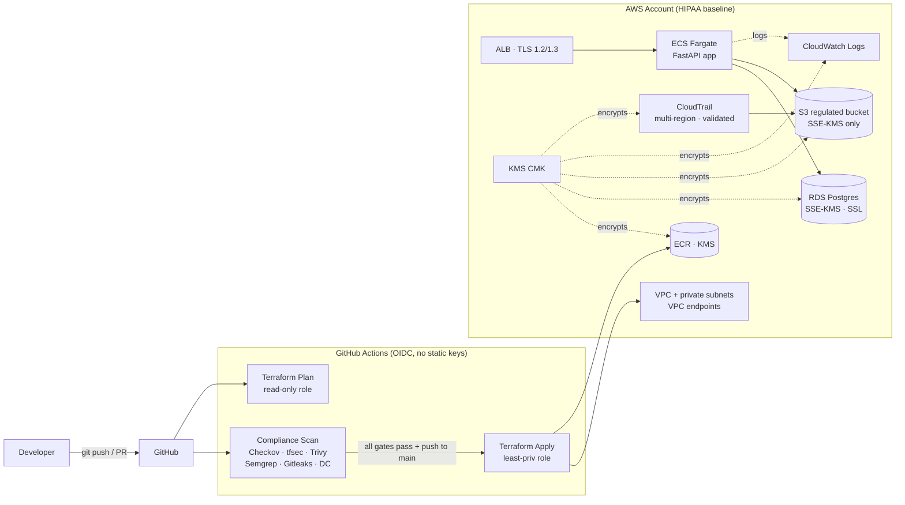

# HIPAA-Compliant AWS Pipeline with Multi-Tool DevSecOps Scanning

[](https://github.com/bubakry/HIPAA-Compliant-Scanning/actions/workflows/compliance-scan.yml)
[](https://github.com/bubakry/HIPAA-Compliant-Scanning/actions/workflows/terraform-plan.yml)
[](https://github.com/bubakry/HIPAA-Compliant-Scanning/actions/workflows/dependency-scan.yml)
[](LICENSE)
[](https://www.terraform.io/)
[](https://aws.amazon.com/fargate/)
[](https://docs.github.com/en/actions/deployment/security-hardening-your-deployments/about-security-hardening-with-openid-connect)

> A reference DevSecOps pipeline that enforces HIPAA-aligned controls on every
> commit: Terraform IaC, container images, Python source, secrets, and open-
> source dependencies are scanned and gated **before** anything reaches AWS.
> No long-lived AWS keys. No "we'll fix it later" findings. Compliance
> evidence is generated automatically as a byproduct of shipping.

## Why this exists

Healthcare workloads carry a fixed compliance burden - encryption at rest,
TLS in transit, audit logs, least privilege, no plaintext PHI in CI. Most
teams document those controls in a wiki and hope reviewers catch gaps.
This repo encodes the same controls as **Terraform modules + CI gates** so
violations fail the build instead of slipping into production.

## Highlights

- **Six-tool security gate** — Checkov, tfsec, Trivy (filesystem + image),
  Semgrep, Gitleaks, and OWASP Dependency-Check run on every PR.
- **Custom Checkov HIPAA policies** — CloudTrail validation, ECS-Exec KMS,
  Secrets Manager KMS, and TLS-listener policies enforced as code.
- **Zero static AWS keys** — GitHub Actions assume separate read-only plan
  and least-privilege apply roles via OIDC.
- **Two-stage deploy** — baseline + ECR first, image push second, ECS
  service last. Deterministic and re-runnable.
- **SARIF everywhere** — every scanner uploads to GitHub Code Scanning so
  findings show up in PRs, not in a Slack thread.
- **All Actions pinned to commit SHAs** — supply-chain hardening matches
  the security theme.

## Architecture



## HIPAA Control Coverage

| Domain | Control | Where it lives |
| --- | --- | --- |
| Encryption at rest | KMS CMK on CloudTrail, CloudWatch, ECR, RDS, Secrets Manager, S3 | `modules/hipaa-infra/kms.tf`, `s3.tf`, `rds.tf` |
| Encryption in transit | TLS 1.2/1.3 ALB listener, forced SSL to RDS | `modules/ecs-app/networking.tf`, `modules/hipaa-infra/rds.tf` |
| Audit logging | Multi-region CloudTrail w/ log file validation, VPC Flow Logs, structured app logs | `modules/hipaa-infra/cloudtrail.tf`, `vpc.tf`, `app/logging_config.py` |
| Identity & access | OIDC-only CI, split plan/apply roles, ECS task/exec role separation | `modules/hipaa-infra/iam.tf`, `modules/ecs-app/iam.tf` |
| Network isolation | Private subnets, no public IPs, VPC endpoints for ECR/Secrets/Logs/SSM | `modules/hipaa-infra/vpc.tf`, `modules/ecs-app/networking.tf` |
| Build-time prevention | 6-tool scan stack with hard fail | `.github/workflows/compliance-scan.yml`, `dependency-scan.yml` |

## CI/CD Gates

Every PR and push runs the full stack:

| Tool | What it scans | Fails on |
| --- | --- | --- |
| Checkov | Terraform + custom HIPAA policies | Any policy violation |
| tfsec | Terraform misconfigurations | High/critical findings |
| Trivy (fs) | Repository filesystem | High/critical CVEs |
| Trivy (image) | Built container image | High/critical CVEs |
| Semgrep | Python SAST + custom rules | Any rule match (`--error`) |
| Gitleaks | Repo history secrets | Any leak |
| OWASP Dependency-Check | Python deps in `requirements.txt` | CVSS ≥ 9 (nightly) |

Production apply only runs after `Compliance Scan` succeeds on a push to `main`.

## Project Structure

```text
.
├── .github/workflows/        # Plan, scan, apply, nightly dependency scan
├── app/                      # FastAPI sample workload
├── compliance/               # Tool configs + custom Checkov/Semgrep policies
├── modules/
│   ├── hipaa-infra/          # Reusable regulated baseline (VPC, KMS, CT, RDS, S3, IAM)
│   └── ecs-app/              # Workload module: ALB, ECS service, ECR, networking
├── scripts/                  # up.sh / down.sh lifecycle helpers
├── tests/                    # FastAPI unit tests
├── main.tf · variables.tf · outputs.tf · providers.tf
└── terraform.tfvars.example
```

## Quickstart

```bash
# Lint, init, validate, test the app
terraform fmt -check -recursive
terraform init -backend=false
terraform validate

python3 -m venv .venv && . .venv/bin/activate
pip install -r requirements.txt
pytest -q

docker build -t hipaa-fastapi-local:test .
docker run -p 18080:8080 hipaa-fastapi-local:test
curl http://127.0.0.1:18080/health/live
```

## Deploying to your own AWS account

### 1. Fork and clone

Fork this repository, then clone your fork.

### 2. Create the Terraform remote state

- An S3 bucket for state
- A DynamoDB table for state locking

Store these as repo secrets:

- `TF_STATE_BUCKET`
- `TF_STATE_LOCK_TABLE`

### 3. Bootstrap GitHub OIDC in AWS

Apply the Terraform once locally (or from a bootstrap admin context) to create
the OIDC provider and the plan/apply roles. Take the outputs and store them
as repo secrets:

- `AWS_TERRAFORM_PLAN_ROLE_ARN`
- `AWS_TERRAFORM_APPLY_ROLE_ARN`

The trust policy is scoped to this repository and to `main` / pull-request
events through GitHub OIDC subjects.

### 4. Configure repository variables

| Name | Required? | Notes |
| --- | --- | --- |
| `ACM_CERTIFICATE_ARN` | yes | ALB HTTPS listener certificate |
| `APPLICATION_DOMAIN_NAME` | optional | Skip and you get the ALB DNS name |
| `ROUTE53_ZONE_ID` | optional | Required only if you set the domain |
| `NVD_API_KEY` | optional | Speeds up the nightly Dependency-Check run |

### 5. Customize Terraform inputs

```bash
cp terraform.tfvars.example terraform.tfvars
```

Adjust:

- CIDR ranges
- Approved ALB ingress CIDRs
- Database sizing
- Domain and certificate references
- Repository name

### 6. Two-stage deployment

The apply workflow intentionally runs in two stages:

1. Terraform creates the baseline + ECR with `enable_service=false`.
2. GitHub Actions builds and pushes the FastAPI image.
3. Terraform applies again with `enable_service=true` and the new image URI.

That keeps the pipeline deterministic without hard-coding a container image
before ECR exists.

### 7. Stand-up / teardown helpers

Two scripts wrap the lifecycle end to end so cloud cost stays bounded:

```bash
./scripts/up.sh         # remote state + apply baseline + run scanners
./scripts/down.sh       # lift safeguards, destroy, delete state backend
```

Configuration precedence (highest first):

1. `TF_VAR_<name>` environment variables.
2. AWS Secrets Manager — set `HIPAA_CONFIG_SECRET=<secret-name>` to a JSON
   blob. Each top-level key is exported as `TF_VAR_<key>`.

   ```json
   {
     "account_id": "123456789012",
     "acm_certificate_arn": "arn:aws:acm:us-east-1:123456789012:certificate/...",
     "application_domain_name": "api.example.com",
     "route53_zone_id": "Z1234567890ABC"
   }
   ```

3. `terraform.tfvars` (gitignored local overrides).
4. `aws sts get-caller-identity` auto-discovers the account ID.

`down.sh` flips `production_safeguards` off, runs `terraform destroy`, then
empties and deletes the state bucket and lock table. KMS keys still respect
AWS's 7-day minimum deletion window.

## Design Notes

- The ALB access-log bucket is intentionally separate from the regulated data
  bucket because ALB access logs only support `SSE-S3`, while the regulated
  bucket enforces `SSE-KMS`.
- Plan and apply roles are split to keep CI separation of duties realistic.
- The compliance baseline is decoupled from the workload module so you can
  swap `modules/ecs-app` with another stack and reuse the regulated baseline.

## Tech Stack

- **AWS** — VPC, ECS Fargate, ECR, RDS PostgreSQL, KMS, S3, CloudTrail,
  CloudWatch Logs, Route 53, IAM
- **IaC** — Terraform 1.14
- **CI/CD** — GitHub Actions with OIDC
- **App** — Python 3.12, FastAPI, Uvicorn, Structlog
- **Scanners** — Checkov, tfsec, Trivy, Semgrep, Gitleaks, OWASP Dependency-Check

## Reusing this in your org

- Drop `modules/hipaa-infra` into any regulated AWS stack as the baseline.
- Swap `modules/ecs-app` with your own workload module while keeping the
  same OIDC, scan, and remote-state patterns.
- Extend `compliance/checkov/policies/` with internal compliance rules.
- Standardize the GitHub Actions workflows across repositories so every
  team gets the same gate.

## Verified locally with

- `terraform fmt -check -recursive`
- Terraform `1.14.8` `init -backend=false` and `validate`
- `pytest -q` (7 tests)
- `docker build` + `/health/live` smoke test

## License

[MIT](LICENSE).
